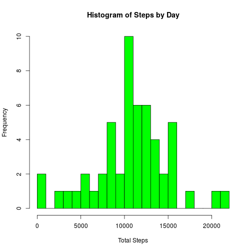
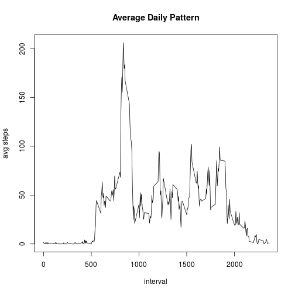
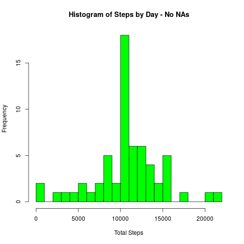

## Loading and preprocessing the data


```r
unzip("activity.zip")

data<-read.csv2("activity.csv", header=TRUE, sep=",", na.strings="NA", colClasses=c("numeric", "Date", "numeric"))
```

## What is mean total number of steps taken per day?


```r
library(data.table)
library(dplyr)

datat <- as.data.table(data)
by_day <- group_by(datat,date)
summary <- summarize(by_day,sum_steps = sum(steps))
hist(summary$sum_steps, breaks=20,main=("Histogram of Steps by Day"),xlab="Total Steps",col="green")
```

 

```r
mean.total.of.steps.per.day <- mean(summary$sum_steps, na.rm=TRUE)
median.total.of.steps.per.day <- median(summary$sum_steps, na.rm=TRUE)
print(paste("Mean total number of steps taken :",mean.total.of.steps.per.day))
```

```
## [1] "Mean total number of steps taken : 10766.1886792453"
```

```r
print(paste("Median total number of steps taken :",median.total.of.steps.per.day))
```

```
## [1] "Median total number of steps taken : 10765"
```

## What is the average daily activity pattern?


```r
by_interval <- group_by(datat, interval)
summary_interval <- summarize(by_interval, avg_steps = mean(steps, na.rm=TRUE))
plot(summary_interval$interval, summary_interval$avg_steps,type="l", ylab="avg steps", xlab="interval",main="Average Daily Pattern")
```

 

```r
max_avg_steps <-  max(summary_interval$avg_steps)
print(paste("Max avg steps :",max_avg_steps))
```

```
## [1] "Max avg steps : 206.169811320755"
```

```r
interval <- summary_interval$interval[which(summary_interval$avg_steps == max(summary_interval$avg_steps))]
print(paste("Interval with the max avg :",interval))
```

```
## [1] "Interval with the max avg : 835"
```

## Imputing missing values


```r
nasteps <- length(data$steps[is.na(data$steps)==TRUE])
nadates <- length(data$date[is.na(data$date)==TRUE])
naintervals <- length(data$interval[is.na(data$interval)==TRUE])

completecases <- length(data$steps[complete.cases(data)==TRUE])
allcases <- length(data$steps)
missing.values <- allcases - completecases

print(paste("There are ", missing.values, " missing values."))
```

```
## [1] "There are  2304  missing values."
```

```r
datat2<-datat

joined <- left_join(datat2,summary_interval, by = "interval")
  
joined$steps[which(is.na(joined$steps))] <- joined$avg_steps[which(is.na(joined$steps))]

by_day2 <- group_by(joined,date)
summary2 <- summarize(by_day2,sum_steps = sum(steps))
hist(summary2$sum_steps, breaks=20,main=("Histogram of Steps by Day - No NAs"),xlab="Total Steps",col="green")
```

 

```r
mean.total.of.steps.per.day2 <- mean(summary2$sum_steps, na.rm=TRUE)
median.total.of.steps.per.day2 <- median(summary2$sum_steps, na.rm=TRUE)
print(paste("Mean total number of steps taken - No NAs:",mean.total.of.steps.per.day2))
```

```
## [1] "Mean total number of steps taken - No NAs: 10766.1886792453"
```

```r
print(paste("Median total number of steps taken - No NAs :",median.total.of.steps.per.day2))
```

```
## [1] "Median total number of steps taken - No NAs : 10766.1886792453"
```

Do these values differ from the estimates from the first part of the assignment?

The values do differ in the following way:


```r
print(mean.total.of.steps.per.day - mean.total.of.steps.per.day2)
```

```
## [1] 0
```

```r
print(median.total.of.steps.per.day - median.total.of.steps.per.day2)
```

```
## [1] -1.188679
```

What is the impact of imputing missing data on the estimates of the total daily number of steps?


## Are there differences in activity patterns between weekdays and weekends?
